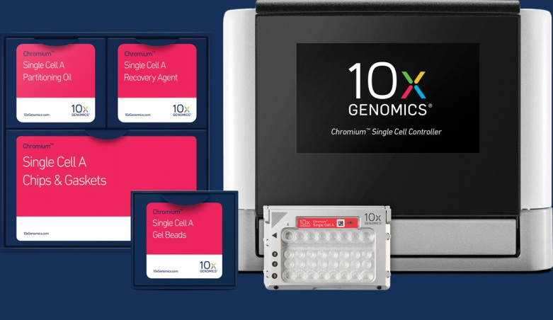
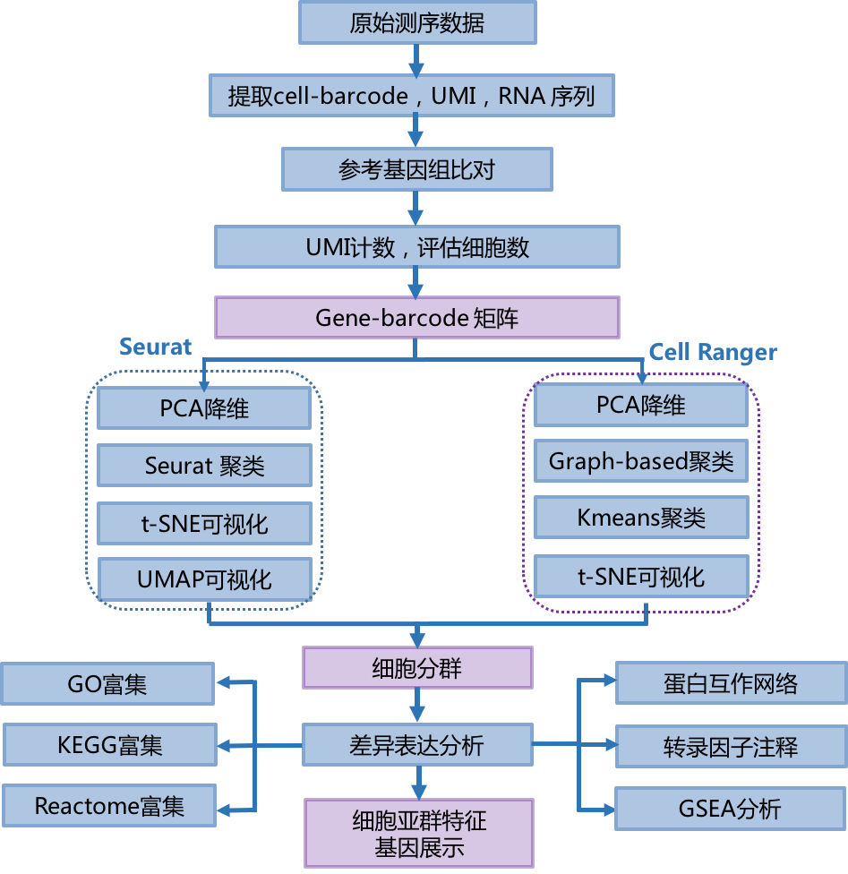
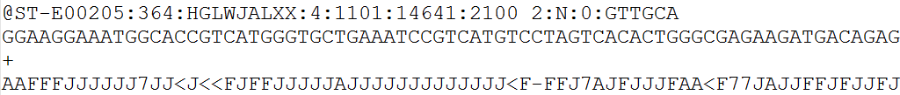
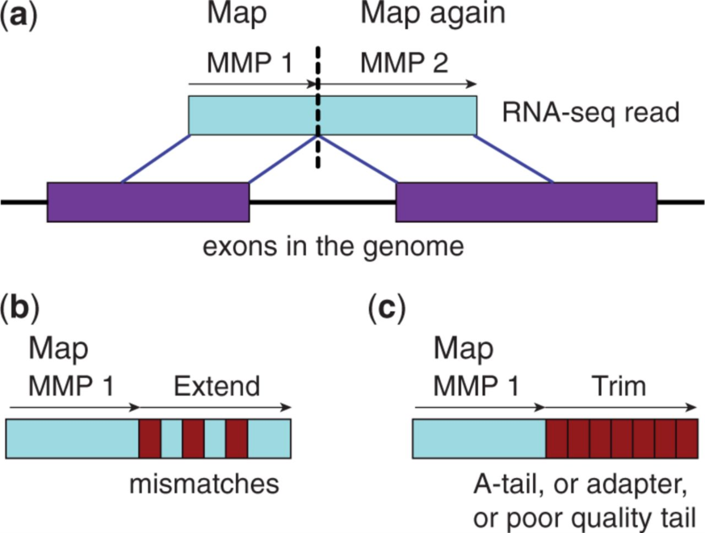
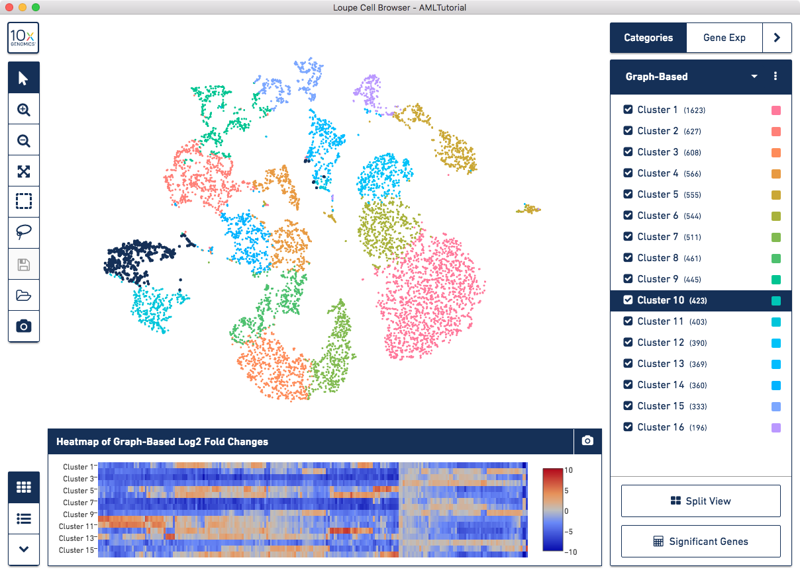
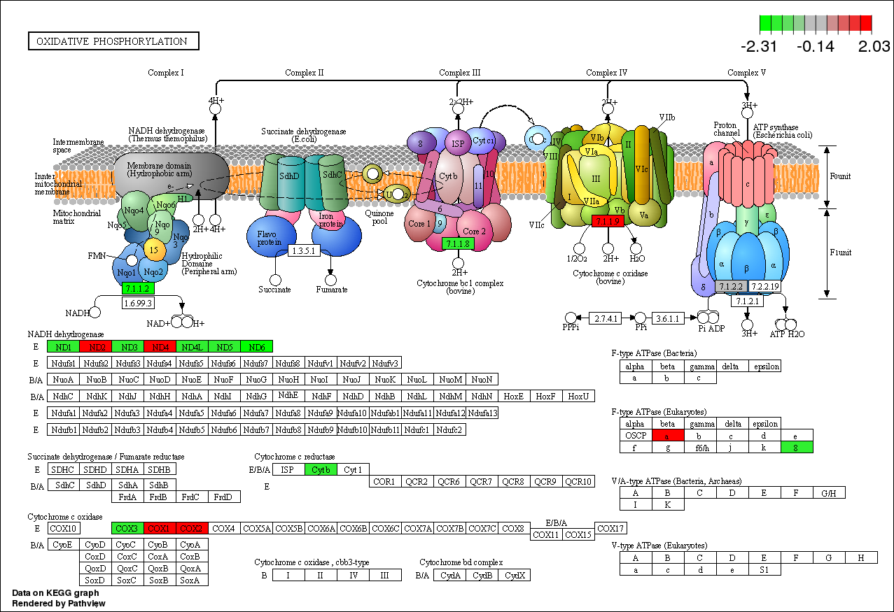

```{r setup, include=FALSE}
knitr::opts_chunk$set(echo = TRUE)
knitr::opts_chunk$set(out.width ="400px",dpi = 120)
viewMotifs. = function (tableSubset, motifCol = c("motif", "bestMotif", "MotifID"), 
                        dbVersion = "v9", nSignif = 3, 
                        colsToShow = c(motifEnrichment = c("motifDb", "logo", "NES", "geneSet", "TF_highConf"), 
                                       regulonTargets = c("TF", "gene", "nMotifs", "logo", "bestMotif","NES", "highConfAnnot", "Genie3Weight")),
                        options = list(pageLength = 50), ...) 
{
  library(RcisTarget)
  
  if (!is.null(motifCol)) {
    motifCol <- motifCol[which(motifCol %in% colnames(tableSubset))]
    if (length(motifCol) == 1) {
      tableSubset <- RcisTarget::addLogo(tableSubset, 
                                         motifCol = motifCol, dbVersion = dbVersion, 
                                         addHTML = TRUE)
      if (!is.null(colsToShow)) 
        colsToShow <- c("logo", colsToShow)
    }
    else {
      stop("Please indicate the column containing the motif id (argument 'motifCol') or set it to NULL.")
    }
    tableSubset <- tableSubset[grep("transfac_pro__", tableSubset[[motifCol]], 
                                    invert = T), ]
  }
  for (i in which(sapply(tableSubset, is.numeric))) {
    tableSubset[[i]] <- signif(tableSubset[[i]], nSignif)
  }
  if (!is.null(colsToShow)) {
    colsToShow <- unique(unname(unlist(colsToShow)))
    colsToShow <- colsToShow[which(colsToShow %in% colnames(tableSubset))]
    tableSubset <- tableSubset[, colsToShow, with = F]
  }
  
  # DT::datatable(tableSubset, escape = FALSE, filter = "top", options = options)
  
  tableSubset$logo = tableSubset$logo %>% gsub(pattern = ".*(http.*png).*",replacement = "\\1")
  
  
  library(kableExtra)
  tableSubset = tableSubset[,c("gene","TF","nMotifs","NES","bestMotif","logo","highConfAnnot","Genie3Weight")]
  tableSubset = tableSubset[!is.na(Genie3Weight)&order(gene),]
  logo = tableSubset$logo
  tableSubset$logo = ""
  tableSubset %>% kbl() %>%
    kable_styling("striped", full_width = T, font_size = 15,
                  html_font = "Glyphicons Halflings") %>%
    row_spec(0, bold = TRUE, background = '#E2EDFA',hline_after = T)  %>%
    column_spec(6, image = spec_image(path =logo ,res = 25,width = 40,height = 18))
}
```

## 1 项目信息   

```{r error=FALSE,echo=F}
library(knitr)
library(kableExtra)
d1 = read.table("src/Tab0.txt",sep = "\t",header = T,check.names = F)
d1 %>%kbl() %>%
  kable_styling("striped", full_width = T, font_size = 15,
              html_font = "Glyphicons Halflings") %>%
  row_spec(0, bold = TRUE, background = '#E2EDFA',hline_after = T) 

```  


## 2 项目介绍    

  Chromium^TM^ Single Cell Gene Expression Solution 是基于 10x Genomics 平台，能够一次性分离、并标记500-10000个单细胞，并能在单细胞水平进行基因表达检测的技术，为单细胞转录组研究提供更具扩展性的平台。Chromium^TM^ Single Cell Gene Expression Solution 是建立在 GemCode 技术上的微流体平台，将带有条形码和引物的凝胶珠和单个细胞包裹在油滴中；接下来在每个油滴内，凝胶珠溶解，细胞裂解释放mRNA，通过逆转录产生用于测序的带条形码的 cDNA。液体油层破坏后，cDNA 后续进行文库构建，然后使用 Illumina 测序平台【1】对文库进行测序检测，即可一次性获得大量单细胞的基因表达数据，从而实现在单细胞水平进行表达测序的目的。    
  
  
<center>     

{width=50% }    

</center>


  有效地解决了组织样本无法破解的细胞异质性难题，有助于发现新的细胞类型；其基于大量的单细胞基因表达数据，可以提供细胞表达特征聚类、亚群表达特征的分析、标志物筛选等方面的分析，是一种高效的细胞基因表达水平的检测技术，在生殖、免疫、干细胞分化、肿瘤发生发展等研究领域中有着广泛的应用。   
  


## 3 项目流程   

<center>    
{width=20% }    

</center>


### 3.1 单细胞样本检测   
  将样本制成单细胞悬浮液，用细胞计数仪进行细胞计数和细胞活率测定，细胞活性高于90%(原代细胞活性高于70%)，并将细胞浓度调整到理想浓度300-600个/μL。   
  


### 3.2 实验流程   
  将制备好的单细胞悬浮液与含有 barcode 信息的凝胶珠以及酶的混合物结合，然后被位于微流体“单十字”连接中的油滴包裹，从而形成 GEMs（Gel Bead-In-EMulsions），有效 GEMs 中包含胶珠（胶珠中有预制的10x引物）、单细胞和 Master Mix。然后，在 GEMs 内进行细胞裂解和逆转录反应，有效 GEMs 中，10x Barcode 将与 cDNA 产物连接在一起，接下来再将 GEMs 破碎并打碎油滴，以 cDNA 为模板进行 PCR 扩增，cDNA 扩增完成以后，针对扩增产物进行质检（扩增片段大小以及扩增产物的产量）。   
     
     
<center>   
J 文库示意图

</center>    


## 4 生物信息基础分析   

  测序完成后、获得原始测序序列(Sequenced Reads)，在有相关物种参考序列或参考基因组的情况下，通过如下流程进行生物信息基础分析：   
  

<center>
{width=60%} 
</center> 

### 4.1 原始序列数据   

#### 4.1.1 原始序列数据说明    
  原始测序数据（Raw data）用 fastq 格式（简称fq格式）保存，文件中包含 reads 的 ID，序列信息以及每个碱基的测序质量值。如果是双端测序，数据会以两个 fq 文件保存（如R1.fq，R2.fq），来自于同一个片段的一对 reads 可以通过ID信息彼此识别。    
  下图是 fastq 格式文件的示意图：    
<center>    

{width=70%}     

</center>

  每条 reads 包含4行信息：    

- 第一行为 reads ID 号，以“@”开头，随后为 Illumina 测序标识符(Sequence Identifiers)和描述性文字；   
- 第二行为碱基序列；   
- 第三行为 Illumina 测序标识符，通常为“+”；   
- 第四行是对应碱基的测序质量，该行中每个字符对应的 ASCII 值减去 33，即为对应第二行碱基的测序质量。   

  以“@ST-E00205:364:HGLWJALXX:4:1101:14641:2100 2:N:0:GTTGCA”为例，Illumina测序标识符详细信息说明如下：    
     

<center>
表 1 reads ID 内容说明   
</center>
```{r echo=F}
library(knitr)
library(kableExtra)
d1 = read.table("src/Tab1.txt",sep = "\t",header = T,check.names = F)
d1 %>%kbl() %>%
  kable_styling("striped", full_width = T, font_size = 15,
              html_font = "Glyphicons Halflings") %>%
  row_spec(0, bold = TRUE, background = '#E2EDFA',hline_after = T)  %>%
  column_spec(1:3, border_left = F,border_right = F) #%>%scroll_box(width = "800px", height = "200px")

```

### 4.2 基本分析   

  该部分结果参见1.Basic_analysis中。    

### 4.2.1 cell-barcode，UMI，RNA序列质控    
  Cell Barcode (CBC)，也叫作10x Barcode，是单个 GEM 液滴的序列称呼，存在于逆转录引物上的随机核苷酸序列，用于捕获实验中单细胞 RNA ，是每个细胞的唯一标识。为识别有效细胞数量，Barcode 应至少满足以下一条：    

- 测得的 Barcode 序列存在于数据库中的已知序列列表；   
- 测得的 Barcode 与已知 Barcode 列表中的某些序列汉明距离为1，依据碱基质量和候选 Barcode（计数分布）的先验概率，计算Barcode由测序误差产生的后验概率。当后验概率>=0.975时，测得的 Barcode 序列得到校正。   

  下表展示相关质控结果：   
  

### 4.2.2 参考基因组比对    
Read包含RNA序列，Cell ranger使用STAR【2】将Read2比对到合适的参考基因组上，同时选取唯一比对的序列用于后续的分析。其中STAR工作原理如下图所示：    

<center>

{width=50%}    
图7 STAR算法
</center>

  STAR 算法原理简要如下：    

- 从read的第一个碱基开始找到 MMP (最大比对索引)。如上图(a)中，read包括一个剪接位点，它不能直接映射到基因组，因此第一个 seed 将被映射到供体一个剪接位点。接下来，针对read的未映射部分重复MMP搜索，在这种情况下，它被映射到受体剪接位点。   
- MMP 搜索能够发现多个 mismatch 和 indel。   
- MMP 能够识别 poly-A 尾，文库接头序列或测序质量差的末端。   

  经 STAR 比对后获得比对统计如下表：    


### 4.3 表达矩阵       

  识别有效细胞后,生成 Gene-barcode 矩阵,记录不同细胞基因的表达值。结果见 1.Basic_analysis/1.2.filtered_feature_bc_matrix。    

#### 4.3.1 基因表达水平
  通过可视化细胞的基因数分布图,UMI 数分布图,可以评估样品所有细胞及表达的基因情况,对于检测到基因数明显异常细胞可能是潜在的多重细胞(multiplets)。细胞基因数,UMI 数小提琴如下:    

<center>
   
图 8  基因和 UMI 小提琴图    
</center>

注：左图为样品所有细胞检测到的基因数量小提琴图,横坐标为样品名,纵坐标为每个细胞中包含的基因数量;右图为 样品所有细胞的 UMI 数量小提琴图,横坐标为样品名,纵坐标为每个细胞 UMI 的数量。小提琴图展示了任意位置的密度,可以知道哪些位置的密度较高。   


  随着测序数据量的增加，单细胞检测到的基因数量和 UMI 的数量也随之增加，两者之间一定相关性，对于UMI和基因数明显离群的细胞有可能是潜在的多重细胞。细胞的 UMI 数与基因数相关性如下图：   

<center>
    

图 9 基因数 UMI 数相关性图
</center>

注：横坐标为细胞的 UMI 的数量，纵坐标为相应细胞的基因数量。图中随着细胞UMI数量增加，检测到基因数也随之增多,两者呈现一种正相关。   


### 4.4 免疫组库    
  使用Cellranger vdj分析得到单细胞 V(D)J 序列及其注释信息。此部分见 1.Basic_analysis/2.4.BCR。    
  免疫细胞克隆信息如下：   

```{r error=FALSE,echo=F}
library(knitr)
library(kableExtra)
d1 = read.table("1.Basic_analysis/1.4.BCR/clonotypes.csv",sep = ",",header = T,check.names = F)
d1 %>% head ()%>% kbl() %>%
  kable_styling("striped", full_width = T, font_size = 15,
              html_font = "Glyphicons Halflings") %>%
  row_spec(0, bold = TRUE, background = '#E2EDFA',hline_after = T) %>% scroll_box(width = "800px", height = "200px")

```     

（1）clonotype_id：B/T细胞克隆型的ID；
（2）frequency：具有这种克隆型的细胞条形码的数量；
（3）proportion：具有这种克隆型的细胞条形码的比例；
（4）cdr3s_aa：该链的CDR3氨基酸序列；
（5）cdr3s_nt：该链的CDR3核苷酸序列。    

注释信息如下：
```{r error=FALSE,echo=F}
library(knitr)
library(kableExtra)
d1 = read.table("1.Basic_analysis/1.4.BCR/filtered_contig_annotations.csv",sep = ",",header = T,check.names = F)
d1 %>% head () %>%kbl() %>%
  kable_styling("striped", full_width = T, font_size = 15,
              html_font = "Glyphicons Halflings") %>%
  row_spec(0, bold = TRUE, background = '#E2EDFA',hline_after = T)  %>% scroll_box(width = "800px", height = "200px")

```    

（1）barcode：contig的细胞条码；   
（2）is_cell：True或False值，指示条形码是否被称为细胞；   
（3）contig_id：contig的唯一标识符；   
（4）high_confidence：True或False值，指示contig是否为高可信度；   
（5）length：contig长度；     
（6）chain：与contig相关的链，如TRA, TRB, IGK, IGL, or IGH；    
（7）v_gene：得分最高的V基因片段；   
（8）d_gene：得分最高的D基因片段；   
（9）j_gene：得分最高的J基因片段；   
（10）c_gene：得分最高的C基因片段；   
（11）full_length：config是否为全长；   
（12）productive：config是否为产物；   
（13）fwr1：氨基酸序列；   
（14）fwr1_nt：核苷酸序列；   
（15）cdr1：氨基酸序列；   
（16）cdr1_nt：核苷酸序列；   
（17）fwr2：氨基酸序列；   
（18）fwr2_nt：核苷酸序列；   
（19）cdr2：氨基酸序列；   
（20）cdr2_nt：核苷酸序列；   
（21）fwr3：氨基酸序列；   
（22）fwr3_nt：核苷酸序列；   
（23）cdr3：氨基酸序列；   
（24）cdr3_nt：核苷酸序列；   
（25）fwr4：氨基酸序列；   
（26）fwr4_nt：核苷酸序列；   
（27）reads：比对到contig的reads数量；   
（28）umis：比对到config的UMI的数量；   
（29）raw_clonotype_id：分配了该细胞条形码的克隆型的ID；   
（30）raw_consensus_id：分配给的共有序列的ID。    


### 4.5 Cell Ranger 细胞分群及差异分析    
#### 4.5.1 细胞分群        

  为了深入剖析样品的异质性，Cellranger 基于基因表达水平对细胞进行分群。分群的思路：首先对表达数据 UMI 归一化，然后 PCA 降维分析，选取10个维度采用 Graph-based【1】，k-means【2】（k=2..10）聚类算法进行细胞分群，同时进行t-SNE【3】降维分析用于可视化。此部分分析见2.Cellranger_advanced。   

* 其中UMI归一化方法如下：

    + 单个细胞：Gene UMI Count /Total UMI Count，记为P；   
    + 所有细胞：所有单个细胞Total UMI Count的中值，记为M；表达值即为P*M；   
    + 表达值经log转换，center，scale 归一化后用于 PCA 分析。   
   

  PCA 是最常用的降维方法，通过某种线性投影，将高维的数据映射到低维的空间中表示，并期望在所投影的维度上数据的方差最大，以此使用较少的数据维度，同时保留住较多的原数据点的特性。   

  t-SNE（t分布随机邻域嵌入） 是一种用于探索高维数据的非线性降维算法。主要包括两个步骤：第一、t-SNE 构建一个高维对象之间的概率分布，使得相似的对象有更高的概率被选择，而不相似的对象有较低的概率被选择。第二，t-SNE 在低维空间里在构建这些点的概率分布，使得这两个概率分布之间尽可能的相似。它将多维数据映射到适合于人类观察的两个或多个维度，广泛应用于图像处理。       


  如下图用每个细胞的UMI总数来展示 t-SNE 降维后结果。具有更大 UMI 计数的细胞可能有更高的RNA含量。坐标轴对应于由 t-SNE 算法产生的二维空间坐标。在这个空间中，彼此靠近的细胞对具有更相似的基因表达谱。    


<center>
   
图 10 细胞UMI计数 t-SNE 图    
注：坐标轴对应于由 t-SNE 算法产生的二维空间坐标, 图中每个点代表一个细胞，点的颜色由 UMI 计数的多少确定。
</center>

  如下图用每个细胞的检测基因总数来展示 t-SNE 降维后结果。彼此靠近的细胞对具有更相似的基因表达谱。    

<center>
        
图 11 细胞基因数量 t-SNE 图    
注：坐标轴对应于由 t-SNE 算法产生的二维空间坐标，图中每个点代表一个细胞，点的颜色由基因数量的多少确定。         


</center>


  Cell ranger 采用了两种算法，多个参数——Graph-based，K-means（k=2..10），基于 PCA 分析结果对细胞聚类分群，尽可能还原细胞真实的分类情况。每个参数分群结果如下图所示：    
<center>
     

    
图 12 细胞分群图    
注：左图坐标轴对应于由 t-SNE 算法产生的二维空间坐标，右图坐标轴对应于由 UMAP 算法产生的二维空间坐标。不同颜色代表不同亚群，右侧图例为亚群名称与对应的亚群颜色。    

</center>

  为了评估细胞分群结果，亚群间的相关性可以作为分群是否合理的一个参考。通过表达水平计算亚群的相关性如下图所示：   


<center>
  
   
图 13 细胞分群相关性图    
注：细胞亚群的相关系数热图，Color Key 由 pearson 相关系数确定，颜色越深，亚群相关性越大；反之，亚群相关性越小。   

</center>
 


#### 4.5.2 差异表达分析    


  差异分析是基于细胞分群结果进行的，目的是找到每个亚群的显著差异基因，作为亚群的特征基因。Cell ranger 使用快速简便的sSeq【4】进行分析，其采用的是负二项式精确检验的方法。当计数变大时，转向使用edgeR中用到的快速渐近 beta 检验【5】。对于每个细胞亚群，差异分析是将该亚群与其他所有亚群做比较，获得每个亚群差异高表达的基因，按照 log2FC 从大到小排序选取top 20的基因作为该细胞亚群的候选特征基因 。    

<center>
表 2 细胞亚群差异表达基因
```{r echo=F}
library(knitr)
library(kableExtra)
table1 = read.table(file = "2.Cellranger_advanced/Cluster_specific_genes/graphclust/differential_expression.csv",sep = ",",header = T)

table1[,1:5] %>%kbl(row.names = F) %>%
  kable_styling("striped", full_width = T, font_size = 15, position ="center",
              html_font = "Glyphicons Halflings") %>%
  row_spec(0, bold = TRUE, background = '#E2EDFA',hline_after = T)   %>%scroll_box(width = "800px", height = "200px")

```
</center>

- Feature.ID：基因ID；   
- Feature.Name：基因名；   
- Cluster.1 .Mean.UMI.Counts：在细胞亚群1中基因的平均 UMI 计数；   
- Cluster.1 .Log2.fold.change：细胞亚群1与其他亚群的基因差异倍数经 log2 转换后的值；   
- Cluster.1 .Adjusted.p.value：细胞亚群1与其他亚群的基因差异表达校正后的统计显性   

   为了进一步确认较为理想的分群结果，并确认可能作为亚群的特征基因。对每个亚群的top20基因进行聚类分析。聚类分析可以获得不同细胞亚群 top20 基因的表达模式，判断同一亚群的基因是否能够聚集成类。因为这些同类的基因可能具有相似的功能，来自同一类型的细胞。我们分别对 Graph-based 和 k-means(k=2..10)算法的分群结果进行聚类分析，结合实验预期，确定较为理想的分群结果。    
 
<center>
    
图 14 细胞亚群top20基因聚类热图    
注：图为细胞亚群top20基因的聚类热图，每一列为一个基因，每一行为一个 Cluster，热图中每个小的区域为基因在 cluster 的平均表达水平，颜色越红，表达水平越高，颜色越蓝表达水平越低，具体见右侧倒数第二个图例。图中第一行的颜色条为相应的基因来自的 cluster 颜色标识，cluster 颜色见最右侧图例。     
</center>
  为深入研究分群结果，找到每个亚群的特征基因，进而确定每个 cluster 可能的细胞类型，绘制了亚群的top20基因表达热图，如下所示：   
<center>
{width=50%}    
图 15  细胞亚群top20基因表达热图（kmeans_5）    
注：左上角图为细胞分群结果图：不同颜色代表不同 cluster 的细胞。其他图为某一亚群的top20基因在所有细胞中的表达热图：图下方为图例，表达量越高，红色越深；图上方为基因id，基因名，表达量处理方式（log2转换）。从图中能够观察到此基因在不同 cluster 细胞中的表达情况，进而可以判断是否可以作为该 cluster 的一个特征基因。   
</center>

  10x Genomics 提供了官方的查看，再分析的可视化软件，界面如下图所示：     
<center>

{width=50%}     
图 16 Loupe Cell Browser 细胞可视化    
</center>
Loupe Cell Browser使用的相关文件见路径：result/Cell_Browser：其中Loupe-Cell-Browser-3.1.1.exe为软件应用程序；Tutorial.html 为软件中英文对照使用说明；result/2.Cellranger_advanced/{sample}/cloupe/cloupe.cloupe为导入文件，安装软件后，双击即可打开。    

### 4.6 Seurat 细胞分群及差异分析    
  Seurat 是一款用于单细胞 RNA-seq 数据的 QC，分析和探索的R包。主要的分析包括识别高度可变基因，数据降维(PCA,t-SNE,UMAP)，细胞聚类，进行差异分析和发现 markers。    
#### 4.6.1 细胞过滤        
  通过可视化细胞的基因数分布图，UMI 数分布图，可以评估样品所有细胞及表达的基因情况，对于检测到基因数明显异常细胞可能是潜在的多重细胞(multiplets)。同时，对于有线粒体基因组信息的物种，能够计算线粒体基因在细胞中表达的比例，指导线粒体的过滤。默认过滤条件为：   

- 细胞过滤：选取 200 < 基因数 ; UMI < 99分位值；线粒体基因表达比例≤25% 三标准同时满足的细胞。   

  细胞基因数，UMI 数，线粒体比例小提琴图如下：    

<center>
{width=60%}         
图 17 基因，UMI，线粒体比例小提琴图    
注：左图为样品所有细胞检测到的基因数量小提琴图，横坐标为样品名，纵坐标为每个细胞中包含的基因数量；中间图为样品所有细胞的 UMI 数量小提琴图，横坐标为样品名，纵坐标为每个细胞 UMI 的数量。右图为样品所有细胞的线粒体比例小提琴图，横坐标为样品名，纵坐标为每个细胞线粒体比例。小提琴图展示了任意位置的密度，可以知道哪些位置的密度较高。    
</center>

  随着测序数据量的增加，单细胞检测到的基因数量和 UMI 的数量也随之增加，两者之间一定相关性，对于 UMI 和基因数明显离群的细胞有可能是潜在的多重细胞。对于线粒体基因比例过高的细胞，也会干扰细胞分群。其中细胞的线粒体比例，基因数与 UMI 数的关系如下图，根据其关系用以过滤细胞。    

<center>
{width=60%}      
图 18 线粒体比例，基因数与 UMI 数散点图   
</center>

#### 4.6.2 细胞分群    
  选定主成分后对细胞进行分群。受 Graph-based 的聚类方法启发，Seurat 将细胞嵌入图形结构中，例如 K-nearest neighbor(KNN) 图，边缘绘制在具有相似基因表达模式的细胞之间，然后尝试将该图分解为高度互连的准亚群。软件首先在 PCA 空间中构建一个基于欧几里德距离的(KNN)图，并根据 Jaccard 距离中的共享重叠来优化任意两个细胞之间的边缘权重。    

  Seurat 提供了两种非线性降维技术，t-SNE 和 UMAP，对分群结果进行可视化(t-SNE 和 UMAP 是对同一分群结果的不同可视化方法)，可视化结果如下图所示：   
<center>
{width=40%}  {width=40%}         

图 19 细胞分群结果    
注：左图坐标轴对应于由t-SNE算法产生的二维空间坐标，不同颜色代表不同亚群，右侧图例为亚群名称与对应的亚群颜色；右图对应 UMAP 算法产生的二维空间坐标   

</center>
    
#### 4.6.3 差异分析    
  差异分析是基于细胞分群结果进行的，目的是找到每个亚群的显著差异基因，作为亚群的 maker 基因，FindClusters 函数实现该过程。具体结果见：result/3.Seurat/3.Cluster_and_diff。其中细胞亚群差异表达基因表格如下：        

<center>
表 3 细胞亚群差异表达基因结果
```{r echo=F}
library(knitr)
library(kableExtra)
table1 = read.table(file = "3.Seurat/3.Cluster_and_diff/2.Cluster_diff/Cluster0.differential_and_annoation.xls",check.names = F,sep = "\t",header = T)

table1 %>%kbl(row.names = F) %>%
  kable_styling("striped", full_width = T, font_size = 15, position ="center",
              html_font = "Glyphicons Halflings") %>%
  row_spec(0, bold = TRUE, background = '#E2EDFA',hline_after = T)   %>%scroll_box(width = "800px", height = "200px")

```
</center>

- gene：基因名；   
- p_val：显著性检验 p 值，如果小数位非常多将显示0；   
- avg_logFC ：细胞表达平均值的差异倍数；   
- pct.1：基因在亚群cluster*中出现的比例；   
- pct.2：基因在其他亚群中出现的比例；   
- p_val_adj：矫正后的p值，如果小数位非常多将显示0；   
- 0:N：该基因在Cluster0:N群所有细胞中的平均UMI值；

  为了了解marker基因在各个亚群的表达情况，将marker基因表达可视化如下图:    


<center>

{width=60%}    
图 20 marker 基因表达小提琴图    
注：横坐标为各个亚群，纵坐标为每个亚群细胞中基因的表达水平。小提琴图展示了任意位置的密度，可以知道哪些位置的密度较高。    

{width=50%}{width=50%}    

图 21 marker 基因表达热图     
注：上图坐标轴对应于由 t-SNE 算法产生的二维空间坐标，颜色由灰色到蓝色，表达水平逐渐增高；下图坐标轴对应 UMAP 算法产生的二维空间坐标。    
</center>


#### 4.6.4 细胞类型注释    
  接下来对聚类的细胞簇进行细胞类型注释。这里使用的软件是SingleR，它是用于单细胞RNA测序（scRNAseq）数据的自动注释方法（Aran et al.2019）。它基于给定具有已知标签的样本（单细胞或RNAseq）参考数据集，将与参考数据的相似细胞标记到测试数据集中的新细胞。   


```{r echo=F}
library(knitr)
library(kableExtra)
table1 = read.table(file = "src/Tab4.txt",check.names = F,sep = "\t",header = T)
table1 %>%kbl(row.names = F) %>%
  kable_styling("striped", full_width = T, font_size = 15, position ="center",
              html_font = "Glyphicons Halflings") %>%
  row_spec(0, bold = TRUE, background = '#E2EDFA',hline_after = T)

```
</center>

  注释后的细胞
<center>
{width=40%} {width=40%}       
图 22 注释后细胞分群结果     
注：左图坐标轴对应于由t-SNE算法产生的二维空间坐标，不同颜色代表不同亚群，右侧图例为亚群名称与对应的亚群颜色；右图对应 UMAP 算法产生的二维空间坐标
</center>


## 5 差异表达基因分析    
### 5.1 差异基因富集分析   
  GO (Gene Ontology, <http://geneontology.org/>) 是基因本体联合会（Gene Onotology Consortium）所建立的数据库，旨在建立一个适用于各种物种的，对基因和蛋白质功能进行限定和描述的，并能随着研究不断深入而更新的语义词汇标准。GO 提供了一系列的语义terms）用于描述基因功能的概念/类，以及这些概念之间的关系。这些语义分为三种不同的种类：细胞学组件（CC: Cellular Component），用于描述亚细胞结构、位置和大分子复合物，如核仁、端粒和识别起始的复合物等；分子功能（MF: Molecular Function），用于描述基因、基因产物个体的功能，如与碳水化合物结合或ATP水解酶活性等；生物学途径（BP: Biological Process），分子功能的有序组合，达成更广的生物功能，如有丝分裂或嘌呤代谢等。      

  KEGG (京都基因与基因组百科全书，Kyoto Encyclopedia of Genes and Genomes)是了解高级功能和生物系统（如细胞、 生物和生态系统），从分子水平信息，尤其是大型分子数据集生成的基因组测序和其他高通量实验技术的实用程序数据库资源，由日本京都大学生物信息学中心的Kanehisa实验室于1995年建立。是国际最常用的生物信息数据库之一，以“理解生物系统的高级功能和实用程序资源库”著称。   

  疾病 (Disease Ontology，简称DO，<http://disease-ontology.org/>)相似关系的研究对于复杂疾病发病机制理解、重大疾病早期预防、诊断、新药物研发及药物安全评估具有重要作用。比如一些牙齿疾病与一些重要系统性疾病，如消化系统疾病、糖尿病、甚至神经系统疾病（如老年痴呆）等有着密切关系。牙齿疾病和这些疾病相似关系的研究对于疾病的预防具有重要作用。另外，相似疾病常常采用类似药物来治疗，通过疾病相似关系的研究可以发现已在临床上应用的“新”药物，降低药物研发成本和临床试验成本。由上可知，差异表达基因的病本体富集分析具有极高的生物学意义。    

  Reactome (<http://www.reactome.org/>)的基础是一个免费的、开源的信号和代谢分子的关系数据库，它们之间的关系组织成生物通路和过程。反应体数据模型的核心单元是反应。参与反应的实体（核酸、蛋白质、复合物、疫苗、抗癌疗法和小分子）形成一个生物相互作用的网络，并被划分为多个途径。经典的中间代谢、信号转导、转录调控、细胞凋亡和疾病等都是反应体的生物学途径。      

#### 5.1.1 富集结果说明        
  功能显著性富集分析是根据差异与背景相比，分析差异表达基因与哪些生物学功能显著相关。该分析首先把所有差异表达基因和背景基因向 数据库的各个条目映射，计算每个条目的基因数目，利用超几何分布进行假设检验得到富集结果的 p-value，这种检验会存在总体假阳性偏高的问题，因此为了降低假阳性，需要对 p-value 进行校正。利用BH进行多重假设检验，校正 p-value，得到 p.adjust 值，p.adjust 越低富集结果越显著。    

  对不同分群结果（默认Graph-based,Seurat）差异分析中每个群top的差异基因（默认20个）采用R包 clusterProfiler【6】、ReactomePA【7】、DOSE【8】进行GO、KEGG、DO（物种为人时可做）、Reactome 富集分析及可视化展示。（富集无结果时，对应文件夹缺少）    

  单细胞富集分析中选取对应物种数据库所有基因作为背景基因。根据差异结果筛选 top 基因后，我们对 top 基因做分类分析及富集分析，研究差异基因在各 Term 中的分布状况，阐明实验中样本差异在基因功能上的体现。    

**由于项目富集结果过多，报告中仅展示 Graph-based 结果，结果说明如下，具体结果请在结果文件夹中查看。**

#### 5.1.2 富集结果表格         

  富集结果请见文件 *_Enrichment_reuslt.xlsx，下方是示例说明。    

<center>
表 4 富集结果
```{r echo=F}
library(knitr)
library(kableExtra)
table1 = read.table(file = "5.Enrichment/graphclust/Cluster.1/GO/BP/Enrichment_reuslt.xlsx",check.names = F,sep = "\t",header = T)

table1 %>%kbl(row.names = F) %>%
  kable_styling("striped", full_width = T, font_size = 15, position ="center",
              html_font = "Glyphicons Halflings") %>%
  row_spec(0, bold = TRUE, background = '#E2EDFA',hline_after = T)   %>%scroll_box(width = "800px", height = "200px")

```
</center>

（1）ID：Term ID；   
（2）Description：Term 名称；   
（3）GeneRatio：富集到 Term 的基因数与总输入基因数比值；   
（4）BgRatio：该 Term 基因数与物种数据库基因总数的比值；  
（5）pvalue：显著性检验 p 值；   
（6）p.adjust：利用BH进行多重假设检验，校正的 p-value；   
（7）geneID：富集到 Term 的基因 SYMBOL；   
（8）Count：富集到 Term 基因个数；  
（9）Hyperlink：Term 链接。（疾病无此列）   


#### 5.1.3 条形图    

<center>    
{width=60%}             
图 23 富集分析条形图

注：选取富集结果前30个（如果少于30个，则画全部） p.adjust 最小的 Term 绘制条形图，横坐标为富集到通路的基因个数。   
</center>    


#### 5.1.4 气泡图        
<center> 
{width=60%}        
图 24 气泡图    
注：选取富集结果前30个（如果少于30个，则画全部）p.adjust 最小的 Term 绘制气泡图，横坐标为 GeneRatio。   
</center> 


#### 5.1.5 网路图      

<center>     
{width=50%}    
图 25 富集网络图    
注：选取富集结果前10个 p.adjust 最小的 Term 绘制网络图，点的大小代表富集到该 Term 的基因个数，连线表示有基因富集在这两个 Term 中。   
</center> 


将富集的Term根据相互重叠的基因集组织成富集Term图，相互重叠的基因集越多Term更倾向于聚集在一起，从而易于识别紧密相关的功能模块。  

<center>     
{width=50%}         

图 26 基因 Term 关系网络图（左右两图仅网络样式存在区别）    
注：选取富集结果前5个 p.adjust 最小的 Term 绘制基因概念网络图，基因与 Term 的连线表示基因富集到该 Term。   
</center> 


#### 5.1.6 富集热图    
   
  富集热图横轴为基因，纵轴为 Term，颜色代表基因的 logFC 值，热图也能直观地反映出基因在作用的 Term，哪些 Term 被相同基因所调节。     

<center>     
{width=50%}      
图 27 基因富集热图

注：选取富集结果前30个（如果少于30个，则画全部）p.adjust 最小的 Term 绘制热图。横轴为基因，纵轴为 Term，颜色代表基因的 logFC 值。         
</center> 

#### 5.1.7 GO有向无环图    

  根据 GO term 之间的关系可以绘制成有向无环图的层次图。    

<center>    
{width=50%}     
图 28 GO DAG 图（仅存在GO结果中）  
注：矩形代表富集到的top10 的 GO terms, 颜色越深，富集越显著。    
</center> 

#### 5.1.8 KEGG通路图       

  通路图是采用R包pathview【9】从 KEGG 官网下载并配色（默认下载前5个 p.adjust 最小的Term），图中红色背景标记的为上调基因，绿色背景标记的为显著下调基因，框内的数字代表 enzyme 的号码，说明对应基因与此酶相关，而整个通路是有很多种不同的酶经过复杂的生化反应形成的。差异基因中与此通路相关的均用不同颜色的框标出，研究人员可以根据自己的研究对象间的差异，重点研究相关通路的差异基因情况，借此进一步解释对应差异的根源。   

<center> 
{width=50%}        
图 29 KEGG 通路图（仅存在于 KEGG 结果中）
注：红色背景标记的为上调基因，绿色背景标记的为下调基因。   
</center> 

### 5.2 差异基因转录因子预测    
  转录因子与基因表达调控区域的特异性结合是基因表达的重要调控方式。利用SCENIC进行单细胞转录因子预测。   
  实际作图过程中我们按基因的degree大小排序，选择排在前100的基因进行作图。具体靶向关系见文件*predicted_TF.xls.        
<center>
表 5 基因转录因子分析结果               
```{r echo=F}
library(knitr)
library(kableExtra)
library(RcisTarget)
table1 = read.table(file = "8.TFBS/celltype/celltype.B.cells/celltype.B.cells.predicted_TF.xls",check.names = F,sep = "\t",header = T)

table1 %>%kbl(row.names = F) %>%
  kable_styling("striped", full_width = T, font_size = 15, position ="center",
              html_font = "Glyphicons Halflings") %>%
  row_spec(0, bold = TRUE, background = '#E2EDFA',hline_after = T)  %>%scroll_box(width = "800px", height = "200px")
# head(table1)
# viewMotifs.(table1[1:10,])

```    
</center>    
（1） TF：转录因子名称；    
（2） gene：基因名；   
（3） nMotifs：Motifs数量；   
（4） bestMotif：最佳Motifs名称；    
（5） NES：bestMotif的标准化富集得分；    
（6） highConfAnnot：可信度是否较高；   
（7） Genie3Weight：TF与靶基因的相关性权重。    
 

<center> 
{width=80%}        
图 30 基因与转录因子网络图    
注：节点越大代表与之相连的节点越多       
</center> 

### 5.3 差异基因蛋白互作网络分析    
  蛋白质是生命及与各种形式的生命活动密切相关的物质基础。生物体中大多数的蛋白质通过彼此之间的相互作用构成蛋白质互作网络来参与生物信号传递、基因调节、能量和物质代谢及细胞周期调控等生命过程的各个环节。蛋白质互作通常可以分为物理互作和遗传互作。物理互作是指蛋白质间通过空间构象或化学键发生的结合或化学反应；遗传互作是指特殊情况下，蛋白/基因的表型变化受其他蛋白/基因影响。    
  目前记录蛋白互作较全的数据库是 STRING 数据库【14】，分析时需要先下载物种的蛋白互作数据，STRING 数据库有以下几种数据来源及打分，最终我们以 combined score 进行筛选。具体的筛选标准如下：   

- 以 combined score 进行筛选，选取前1500个结果；    
- 然后用根据基因的度由大到小排序，取前100的基因，并对包含此100基因的互作对进行作图。   

<center>
表 6 STRING数据库蛋白关系来源与打分       
```{r echo=F}
library(knitr)
library(kableExtra)
table1 = read.table(file = "src/Tab5.txt",check.names = F,sep = "\t",header = T)

table1 %>%kbl(row.names = F) %>%
  kable_styling("striped", full_width = T, font_size = 15, position ="center",
              html_font = "Glyphicons Halflings") %>%
  row_spec(0, bold = TRUE, background = '#E2EDFA',hline_after = T)   #%>%scroll_box(width = "800px", height = "200px")

```    
</center>
  在 STRING 数据库中，两个蛋白或者基因间的 combined score 大于设定阈值时，如果这两个基因或者蛋白在比较中都是显著差异的，则这一对基因或者蛋白被提取出来。差异基因蛋白互作列表见:Cluster\*.propro.network.txt； 差异基因蛋白互作node列表见：Cluster\*.propro.node.txt      
  
<center>
表 7 差异基因蛋白互作列表        
```{r echo=F}
library(knitr)
library(kableExtra)
table1 = read.table(file = "7.PPI/celltype/celltype.B.cells.propro.network.xls",check.names = F,sep = "\t",header = T)

table1 %>%kbl(row.names = F) %>%
  kable_styling("striped", full_width = T, font_size = 15, position ="center",
              html_font = "Glyphicons Halflings") %>%
  row_spec(0, bold = TRUE, background = '#E2EDFA',hline_after = T)  %>% scroll_box(width = "800px", height = "200px")

```    
</center>
（1）source：source gene symbol；    
（2）target：target gene symbol；    
（3）importance：为蛋白互作的打分Score，打分越高蛋白互作可信度越高，最高为1。   

<center>
表 8 差异基因蛋白互作node列表          
```{r echo=F}
library(knitr)
library(kableExtra)
table1 = read.table(file = "7.PPI/celltype/celltype.B.cells.propro.node.xls",check.names = F,sep = "\t",header = T)

table1 %>%kbl(row.names = F) %>%
  kable_styling("striped", full_width = T, font_size = 15, position ="center",
              html_font = "Glyphicons Halflings") %>%
  row_spec(0, bold = TRUE, background = '#E2EDFA',hline_after = T)   %>% scroll_box(width = "800px", height = "200px")

```    
</center>
（1）nodes_name：蛋白id；   
（3）res：基因类型；    
（4）nodes_degree：该蛋白的度。   

<center>
{width=80%}          

图 31 差异基因蛋白网络互作图    
注：圆圈为节点，大小代表度的大小    
</center>


### 5.4 差异基因GSEA分析（仅限人或小鼠可分析）   

  Gene Set Enrichment Analysis （GSEA）基因集富集分析，用于确定先验基因集是否在两种生物状态（例如表型）之间差异显著。（GSEA软件的网址： [http://software.broadinstitute.org/gsea/index.jsp](http://software.broadinstitute.org/gsea/index.jsp) ）    
  GSEA 的优势是不局限于差异基因，不需要指定明确的差异基因阈值，可以在基因集（也就是多个基因）水平上来处理表达谱数据。这里所说的基因集（gene sets）是指基于当前积累的知识，例如关于生物通路知识或以前得到的共表达数据来定义的一组基因。算法会根据实际数据的整体趋势即基因集的富集角度出发，理论上更容易囊括细微但协调性变化的基因对生物通路的影响。    


#### 5.4.1 GSEA富集原理    
GSEA 富集原理：    

- 根据所有基因的表达数据，计算每个基因在两个分组 Case、Control 中的差异度（signal2 noise），然后按照在两个表型中的差异度从大到小排序，形成一个排好序的基因列表L;    
- 判断基因集S中的基因s是否在排序表L的顶端或者底端富集。    
- 计算基因集的ES（Enrichment Score）富集得分。计算方法：从目标基因列表L的第一个基因开始，计算一个累计统计值。当遇到一个落在基因集S里面的基因，则增加统计值。遇到一个不在基因集S里面的基因，则降低统计值，增量的大小取决于基因与表型的相关性。最高峰为富集得分值（ES）    
- 计算 ES 的显著性水平（名义P值）。显著性是通过置换检验 (permutation test)的方法来进行检验的。具体过程是，我们转换不同分数下的数据，并且再一次计算ES值，使之形成一个新的假设的ES分布，如果交换之后，ES 的p值相对于新的ES值（统计分布）来说若是显著的变化，则说明该基因集会有生物学意义。    
- 多重假设检验。当评估了所有基因的数据之后，我们要使用多重假设检验来评估它们的显著性。首先把每一个基因的ES值根据基因集的大小进行标准化，得到 Normalized Enrichment Score（NES），之后针对 NES 计算 FDR（ false discovery rate），FDR 是评估一个NES表达值中所发现的假阳性可能性大小；它是由NES的观测值和零分布时比较得出的。在大多数情况下，选择FDR值为25%来判定是否是富集的功能基因集是合适的，因为通常用于分析的芯片表达数据之间。但是，当分析的数据集较小，分析时选择的是探针间的随机组合（gene-setper-mutation）选择 FDR 小于5%合适。    

#### 5.4.2 GSEA结果解读    
对于每个先验基因集*.tsv都包含一个excel文件：   
<center>
表 9 GSEA基因集合富集结果
```{r echo=F}
library(knitr)
library(kableExtra)
table1 = read.table(file = "6.GSEA/graphclust/Cluster.1_VS_clusterRest/c2.KEGG.Gsea/KEGG_ALPHA_LINOLENIC_ACID_METABOLISM.tsv",check.names = F,sep = "\t",header = T)

table1 %>%kbl(row.names = F) %>%
  kable_styling("striped", full_width = T, font_size = 15, position ="center",
              html_font = "Glyphicons Halflings") %>%
  row_spec(0, bold = TRUE, background = '#E2EDFA',hline_after = T)   %>% scroll_box(width = "800px", height = "200px")

```   
</center>    
（1）NAME：代表行数，第一行的index为0；
（2）PROBE：代表基因名称；
（3）GENE SYMBOL：代表基因名称；
（4）GENE_TITLE：代表基因描述信息；
（5）RANK IN GENE LIST：代表该基因在排序号的列表中的位置；
（6）RANK METRIC SCORE：代表该基因排序量的值，比如foldchange值；
（7）RUNNIG ES：代表累计的Enrichment score；
（8）CORE ENRICHMENT：代表是否属于核心基因，即对该基因集的 Enrichment score做出了主要贡献的基因。

这个表格中的数据对应下面这张图：    
<center>
{width=50%}      
图 32 基因集合富集结果图    
注：该图分成3个部分，第一部分为基因 Enrichment Score 的折线图，横轴为该基因下的每个基因，纵轴为对应的 Running ES，在折线图中有个峰值，该峰值就是这个基因集的 Enrichemnt score，峰值之前的基因就是该基因集下的核心基因，如果在顶部富集，我们可以说，从总体上看，该基因集是上调趋势，反之，如果在底部富集，则是下调趋势；第二部分为hit，用线条标记位于该基因集下的基因；第三部分为所有基因的 rank 值分布图，默认采用 Signal2Noise 算法，对应了纵轴的标题。   

{width=40%}    
图 33 基因集的热图    
注：热图展示的是位于该基因集下的基因在所有样本中表达量的分布，其中每一列代表一个样本。每一行代表一个基因，基因表达量从低到高，颜色从蓝色过渡到红色   

</center>    


## 6 软件列表   
<center>
```{r echo=F}
library(knitr)
library(kableExtra)
table1 = read.table(file = "src/Tab3.txt",check.names = F,sep = "\t",header = T)

table1 %>%kbl(row.names = F) %>%
  kable_styling("striped", full_width = T, font_size = 15, position ="center",
              html_font = "Glyphicons Halflings") %>%
  row_spec(0, bold = TRUE, background = '#E2EDFA',hline_after = T)   #%>%scroll_box(width = "800px", height = "200px")

```
</center>


## 7 参考文献    

(@) Zheng G X Y, Terry J M, Belgrader P, et al. Massively parallel digital transcriptional profiling of single cells[J]. Nature Communications, 2017, 8:14049.    
(@) Dobin A, Davis C A, Schlesinger F, et al. STAR: ultrafast universal RNA-seq aligner[J]. Bioinformatics, 2013, 29(1):15-21.    
(@) Jaitin D A, Kenigsberg E, Keren-Shaul H, et al. Massively parallel single-cell RNA-seq for marker-free decomposition of tissues into cell types[J]. Science, 2014, 343(6172):776-9.    
(@) Klein A M, Mazutis L, Akartuna I, et al. Droplet barcoding for single-cell transcriptomics applied to embryonic stem cells.[J]. Cell, 2015, 161(5):1187-201.    
(@) Blondel V D, Guillaume J L, Lambiotte R, et al. Fast unfolding of community hierarchies in large networks[J]. J Stat Mech, 2008, abs/0803.0476    
(@) Sherlock G. Analysis of large-scale gene expression data.[J]. Current Opinion in Immunology, 2000, 12(2):201-205.    
(@) HintonGE.VisualizingHigh-DimensionalDataUsingt-SNE[J].VigiliaeChristianae,2008, 9(2):2579-2605.    
(@) Yu D, Huber W, Vitek O. Shrinkage estimation of dispersion in Negative Binomial models for RNA-seq experiments with small sample size[M]. Oxford University Press, 2013.    
(@) Robinson M D, Smyth G K. Small-sample estimation of negative binomial dispersion, with applications to SAGE data.[J]. Biostatistics, 2008, 9(2):321-332.    
(@) Guangchuang Yu, Li-Gen Wang, Yanyan Han, Qing-Yu He. clusterProfiler: an R package for comparing biological themes among gene clusters. OMICS: A Journal of Integrative Biology. 2012, 16(5):284-287.     
(@) Guangchuang Yu, Qing-Yu He. ReactomePA: an R/Bioconductor package for reactome pathway analysis and visualization. Molecular BioSystems 2016, 12(2):477-479.    
(@) Guangchuang Yu, Li-Gen Wang, Guang-Rong Yan, and Qing-Yu He. 2015. “DOSE: An R/Bioconductor Package for Disease Ontology Semantic and Enrichment Analysis.” Bioinformatics 31 (4): 608-609.     
(@) Luo, Weijun, and Cory Brouwer. 2013. “Pathview: An R/Bioconductor Package for Pathway-Based Data Integration and Visualization.” Bioinformatics 29 (14): 1830–1831.     
(@) D. Szklarczyk et al., “STRING v10: Protein-protein interaction networks, integrated over the tree of life,” Nucleic Acids Res., vol. 43, no. D1, pp. D447–D452, 2015.     
(@) A. Sandelin, “JASPAR: an open-access database for eukaryotic transcription factor binding profiles,” Nucleic Acids Res., vol. 32, no. 90001, p. 91D–94, 2004.     
(@) G. Tan and B. Lenhard, “TFBSTools: an R/bioconductor package for transcription factor binding site analysis.,” Bioinformatics, vol. 32, no. 10, pp. 1555–6, 2016.    

## 结果文件说明    

├── 1.Basic_analysis点击打开

|   ├── 2.1.raw_feature_bc_matrix：初始Gene-barcode矩阵

|   │   ├── barcodes.tsv.gz：所有的barcodes列表

|   │   ├── features.tsv.gz：所有的基因列表

|   │   └── matrix.mtx.gz：Gene-barcode 表达矩阵

|   ├── 2.2.filtered_feature_bc_matrix：有效细胞Gene-barcode矩阵

|   │   ├── barcodes.tsv.gz：细胞的barcodes列表

|   │   ├── features.tsv.gz：检测到的基因列表

|   │   └── matrix.mtx.gz：Gene-barcode 表达矩阵

|   ├── 2.3.h5_files：h5文件

|   │   ├── raw_feature_bc_matrix.h5：Gene-cell 表达矩阵（HDF5格式）

|   │   ├── filtered_feature_bc_matrix.h5：Gene-cell 表达矩阵（HDF5格式）

|   │   ├──  molecule_info.h5：所有分子信息

|   ├── 2.4.BCR:  BCR文库相关分析结果文件 

|   ├── web_summary.html：10x Genomics web报告

|   ├── metrics_summary.csv：样品质控信息统计总表

|   ├── metrics_summary_json.json：10x Genomics json报告

|   ├── nGene_and_nUMI_correlation.pdf：细胞UMI与基因数相关性图

|   ├── nGene_and_nUMI_Distribution.pdf：细胞基因数，UMI数小提琴图

|   ├── nGene.histogram.pdf：细胞基因数量分布图

|   └── nUMI.histogram.pdf：细胞UMI数量分布图

├── 2.Cellranger_advanced点击打开

|   ├── cloupe

|   |   ├── count

|   |   |   └── cloupe.cloupe：细胞分群结果，使用上述软件查看

|   │   └── vdj_b

|   |   |   └── vloupe.vloupe：BCR/TCR结果，使用上述软件查看

|   ├── Cluster_specific_genes

|   │   └── graphclust：不同分群算法文件夹，如graphclust

|   │       ├── graphclust.Cluster_*.pdf：Cluster* marker基因热图

|   │       ├── graphclust.differential_expression.xls：差异表达基因及注释汇总表

|   │       ├── graphclust.diffexp.volcano.pdf：差异表达基因火山图

|   │       └── graphclust.pheatmap.pdf：Cluster top20差异基因热图

|   ├── correlation：不同分群相关性图文件夹

|   │   ├── graphclust.subpopulation.correlation.pdf：基于graphclust聚类算法获得的亚群相关性

|   │   └── kmeans_*_clusters.subpopulation.correlation.pdf：kmeans（k=2..10）算法获得的亚群相关性

|   ├── nCell_per_cluster.xls：细胞亚群分类统计

|   ├── summary_cell.pca_tsne_clustering.csv：细胞分群信息汇总

|   ├── pca_cluster：不同分群pca二维坐标展示

|   │   ├── pca.graphclust.pdf：graphclust的2D- pca细胞分群图

|   │   └── pca.kmeans_*_clusters.pdf：kmeans（k=2..10）的2D- pca细胞分群图

|   ├── tsne_cluster：不同分群tsne二维坐标展示

|   │   ├── tsne.graphclust.pdf：graphclust的2D-t-SNE细胞分群图

|   │   └── tsne.kmeans_*_clusters.pdf:kmeans（k=2..10）的2D-t-SNE细胞分群图｀

|   ├── umap_cluster：不同分群UMAP二维坐标展示

|   │   ├── umap.graphclust.pdf：graphclust的2D-UMAP细胞分群图

|   │   └── umap.kmeans_*_clusters.pdf：kmeans（k=2..10）的2D-UMAP细胞分群图｀

|   ├── tsne.nGene.pdf：2D-t-SNE细胞基因数量热图

|   └── tsne.nUMI.pdf：2D-t-SNE细胞UMI数量热图

├── 3.Seurat

|   ├── 1.Expression：数据表达结果展示

|   │   ├── 1.nGene_nUMI_percent.mito.pdf：基因、UMI、线粒体基因表达等分布图

|   │   ├── 2.Percent.mito_and_nGene_associate_with_nUMI.pdf：线粒体基因比例和总基因相关性图

|   │   └── 3.Detect_variable_genes.pdf：基因离散度图

|   ├── 2.PCA_analysis：PCA分析结果展示

|   │   ├── 1.pca50_vargene.xls：PCA分析结果中PC50基因

|   │   ├── 2.Pc50_top20_sep.txt：top20基因的PC贡献值

|   │   ├── 3.Top30_gene_with_PC1_PC2.pdf

|   │   ├── 4.Top30_gene_PC1_heatmap.pdf：PC1中基因热图

|   │   ├── 5.Pca50_heatmap.pdf：PC50的热图

|   │   ├── 6.PC_significant.pdf：PC显著性结果

|   │   └── 7.Pc50_sd.pdf：PC50的离散度分布

|   ├── 3.Cluster_and_diff

|   │   ├── 1.All_cluster_up_marker.xls：total marker基因信息

|   │   ├── 1.Cell_cluster_byTSNE.pdf：细胞分群结果（TSNE降维）

|   │   ├── 1.Cell_cluster_byUMAP.pdf：细胞分群结果（UMAP降维）

|   │   ├── 2.Cluster_diff：细胞差异marker结果

|   │   │    └── Cluster*.differential_and_annoation.xls：cluster*中的所有基因差异信息及注释

|   │   ├── 3.Cluster_marker_gene_plot

|   │   │    ├── Cluster*_top20_gene_diffInf.xls：Cluster*_top20基因的差异及注释信息

|   │   │    ├── Cluster*_top20_gene_featureExp.xls：top20 基因在Cluster*中的表达量

|   │   │    ├── Cluster*_top_gene_exp.pdf：top20基因在每个群细胞的表达量小提琴图

|   │   │    ├── Cluster*_top_gene_feature_byTSNE.pdf：top20基因在每个群细胞的表达量热图（TSNE坐标）

|   │   │    └── Cluster*_top_gene_feature_byUMAP.pdf：top20基因在每个群细胞的表达量热图（UMAP坐标）

|   │   ├── 4.Top20_cluster_pos_marker_forheatmap.xls：所有cluster top20基因的信息

|   │   ├── 5.Cluster_top20_express_heatmap.pdf：所有cluster top20基因的热图

|   │   ├── Cluster_info.xls：各细胞的cluster信息及t-SNE坐标信息

|   │   └── Cluster_num_stat.xls：各cluster中细胞数目

├── 4. celltype_annotation

│   ├── 1.All_celltype_up_marker.xls：total marker基因信息

│   ├── 1.Cell_celltype_byTSNE.pdf：细胞分群结果（TSNE降维）

│   ├── 1.Cell_celltype_byUMAP.pdf：细胞分群结果（UMAP降维）

│   ├── 2.Cluster_diff：细胞差异marker结果

│   │    └── Cluster*.differential_and_annoation.xls：celltype*中的所有基因差异信息及注释

│   ├── 3.Cluster_marker_gene_plot

│   │    ├── Cluster*_top20_gene_diffInf.xls：Cluster*_top20基因的差异及注释信息

│   │    ├── Cluster*_top20_gene_featureExp.xls：top20 基因在Cluster*中的表达量

│   │    ├── Cluster*_top_gene_exp.pdf：top20基因在每个群细胞的表达量小提琴图

│   │    ├── Cluster*_top_gene_feature_byTSNE.pdf：top20基因在每个群细胞的表达量热图（TSNE坐标）

│   │    └── Cluster*_top_gene_feature_byUMAP.pdf：top20基因在每个群细胞的表达量热图（UMAP坐标）

│   ├── 4.Top20_celltype_pos_marker_forheatmap.xls：所有celltype top20基因的信息

│   ├── 5.Cluster_top20_express_heatmap.pdf：所有celltype top20基因的热图

│   ├── Cluster_info.xls：各细胞的celltype信息及t-SNE坐标信息

│   └── Cluster_num_stat.xls：各celltype中细胞数目

├── 5.Enrichment

|   ├── graphclust：不同的分群方式

|       └── Cluster*：群id

|           ├── Cluster*.gene.txt ：挑选出来的top基因

|           ├── Disease：Disease富集结果(物种为人时才有该文件夹)

|           ├── GO：GO富集结果

|           ├── KEGG：KEGG富集结果

|           └── Reactome：Reactome富集结果

|   ├── celltype：不同的分群方式

|       └── cell*：细胞名称

|           ├── celltype*.gene.txt ：挑选出来的top基因

|           ├── Disease：Disease富集结果(物种为人时才有该文件夹)

|           ├── GO：GO富集结果

|           ├── KEGG：KEGG富集结果

|           └── Reactome：Reactome富集结果

|   ├── seurat：不同的分群方式

|       └── Cluster*：群id

|           ├── Cluster*.gene.txt ：挑选出来的top基因

|           ├── Disease：Disease富集结果(物种为人时才有该文件夹)

|           ├── GO：GO富集结果

|           ├── KEGG：KEGG富集结果

|           └── Reactome：Reactome富集结果

├── 6.GSEA

|   ├── graphclust：不同的分群方式

|       └── Cluster*_VS_ClusterRest：比较组合Cluster*_VS_ClusterRest

|   ├── seurat：不同的分群方式

|       └── Cluster*_VS_ClusterRest：比较组合Cluster*_VS_ClusterRest

|   └── celltype：不同的分群方式

|       └── celltype*_VS_celltypeRest：比较组合celltype*_VS_celltypeRest

├── 7.PPI点击打开

|   ├── graphclust：不同的分群方式

|       ├── Cluster*.propro.network.pdf(png)：Cluster*蛋白网络互作

|       ├── Cluster*.propro.network.txt

|       └── Cluster*.propro.node.txt

|   ├── seurat：不同的分群方式

|       ├── Cluster*.propro.network.pdf(png)：Cluster*蛋白网络互作

|       ├── Cluster*.propro.network.txt

|       └── Cluster*.propro.node.txt

|   └── celltype：不同的分群方式

|       ├── celltype*.propro.network.pdf(png)：celltype*蛋白网络互作

|       ├── celltype*.propro.network.txt

|       └── celltype*.propro.node.txt

├── 8.TFBS点击打开

|   ├── graphclust：不同的分群方式

|       └── Cluster*：群id

|           ├── predicted_TF.xls : 转录因子预测结果

|           ├── TF.network.pdf(png)

|           ├── TF.network.txt

|           └── TF.node.txt

|   ├── seurat：不同的分群方式

|       └── Cluster*：群id

|           ├── predicted_TF.xls : 转录因子预测结果

|           ├── TF.network.pdf(png)

|           ├── TF.network.txt

|           └── TF.node.txt

|   ├── celltype：不同的分群方式

|       └── celltype*：群id

|           ├── predicted_TF.xls : 转录因子预测结果

|           ├── TF.network.pdf(png)

|           ├── TF.network.txt

|           └── TF.node.txt

├── src：报告需加载文件夹

└── {sample}.10x_report.html：网页版结题报告报告


